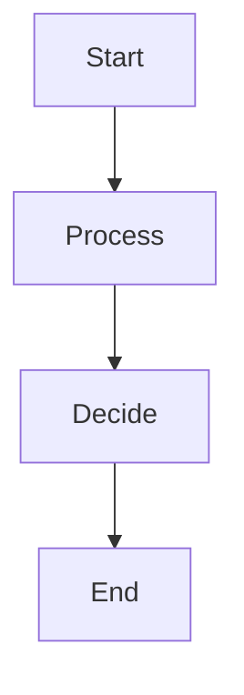
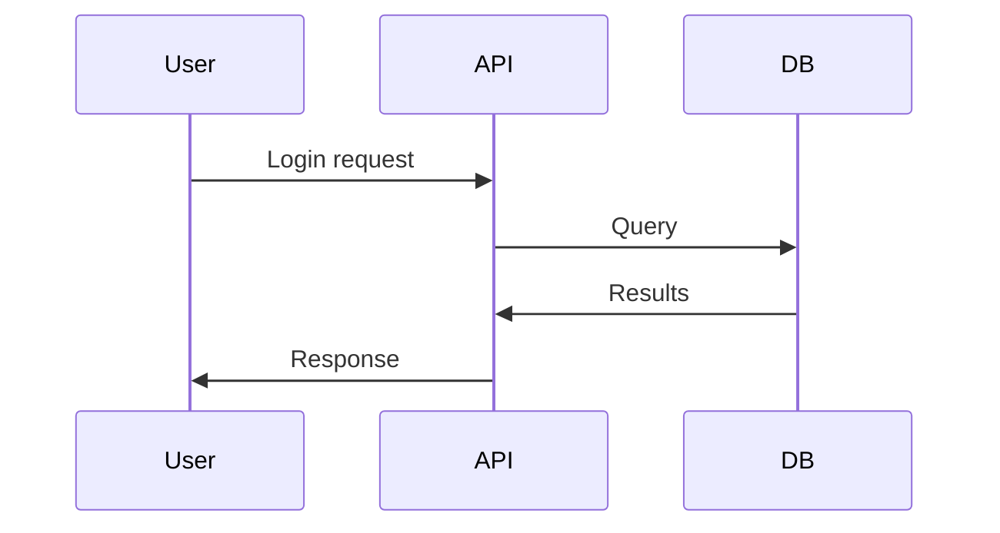
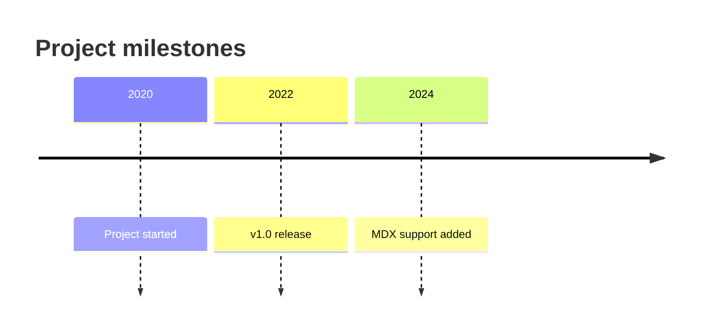
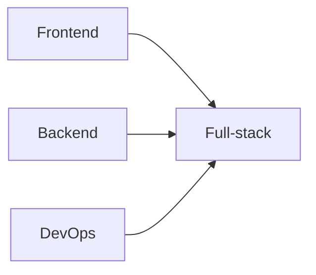
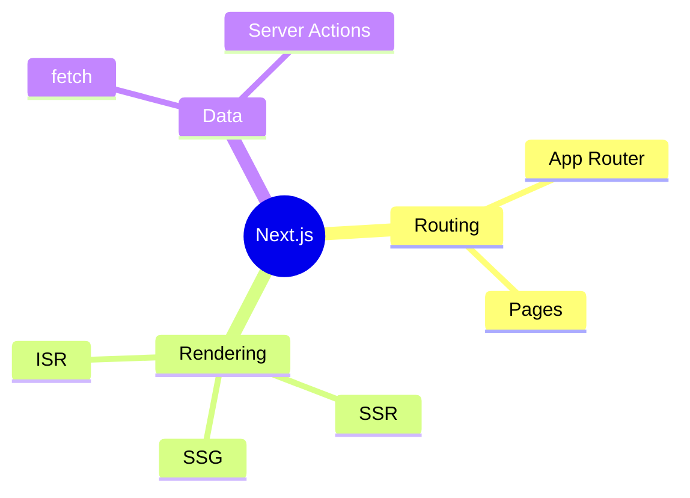
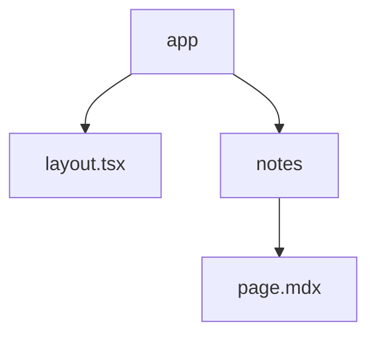

# My Visual Note

This is a **visual note** written in MDX. You can mix Markdown with React components!

<VisualNote variant="sticky" title="Quick reminder">
  MDX lets you embed React components directly in your content.
  Diagrams are rendered from Mermaid code blocks at build time.
</VisualNote>

## Diagrams

### Flowchart

### Sequence

### Timeline

### Skill Overlap

### Mind Map

### Project Structure

## Visual Notes

<VisualNote variant="tip" title="Pro tip">
  Use different variants: `info`, `tip`, `idea`, `warning`, or `sticky`
  to style your notes for different contexts.
</VisualNote>

<VisualNote variant="idea">
  No title? The icon still shows. Great for quick visual cues.
</VisualNote>

## What you can do

- Write **bold** and *italic* text
- Use lists and code blocks
- Embed Mermaid diagrams with fenced code blocks
- Export metadata for dynamic pages
